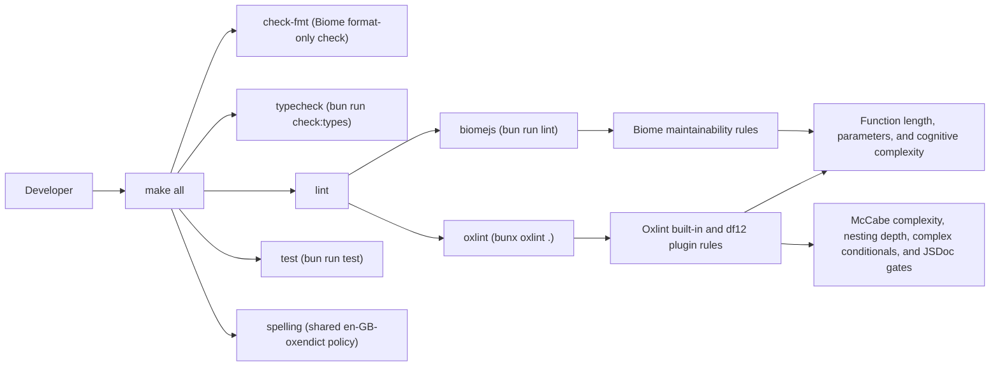

# Development guide

This repository uses Bun, Biome, TypeScript, and a small Makefile wrapper for
the common contributor workflow.

## Local setup

```bash
bun install
```

The package expects Bun to run scripts, tests, and formatting commands.

## Day-to-day workflow

Prefer the Makefile targets where available:

- `make check-fmt`
- `make lint`
- `make markdownlint`
- `make spelling`
- `make test`
- `make all`
- `make build`

The normal contributor gate is:

1. `bun fmt`
2. `bun lint`
3. `bun check:types`
4. `bun test`

`make all` runs `check-fmt`, `typecheck`, `lint`, `test`, and `spelling` in the
repository's preferred order. The `lint` target runs the `biomejs` and `oxlint`
sub-targets.

## URL derivation

The GitHub store is host-agnostic. Entity schemas preserve caller-supplied URL
fields, including explicit `null` where the GitHub shape allows it, but they do
not synthesize simulator-host URLs while parsing fixtures.

Request-derived URL policy is split across two layers:

- `src/http/request-url.ts` normalizes the configured `apiUrl` (including its
  API root), derives API and web base URLs from a request origin, and falls
  back to `SIMULACAT_GITHUB_API_URL` only when the request has no usable
  HTTP(S) host.
- `src/urls/` contains pure per-entity projectors for repository,
  organization, branch, ref, commit, issue, and pull request payloads.

New REST or GraphQL handlers should project URL-bearing payloads at the adapter
boundary instead of reading derived URL fields from the store. Relevant
coverage lives in `tests/request-url.test.ts`, `tests/urls.test.ts`,
`tests/rest-request-urls.test.ts`, and the request-host GraphQL coverage in
`tests/graphql.test.ts`.

Set `SIMULACAT_URL_OBSERVABILITY=1` or `true` to emit structured diagnostics
for request-derived URL handling. The associated Prometheus counter is
`simulacat_url_derivation_observations_total`; it keeps `event`, `transport`,
`outcome`, and `reason` labels bounded. Request IDs stay in logs only, and raw
hosts and fixture identifiers are excluded from metrics.

### Spelling policy

Run `make spelling` to enforce en-GB-oxendict spelling in tracked Markdown
prose. The generated `typos.toml` starts from the shared Oxford dictionary and
applies the narrow repository policy in `typos.local.toml`. Edit the local
policy, then run `make spelling-config` rather than changing generated entries
by hand. The focused shared config builder refreshes its untracked dictionary
cache only when the authoritative copy is newer.

The helper remains syntax-compatible with Python 3.13, and isolated Ruff checks
therefore target `py313`. Normal rollout commands continue to execute it with
Python 3.14.

The following diagram summarizes the current Makefile quality-gate flow:



Caption: The `make all` target runs format checking, type-checking, linting,
tests, and spelling. Linting is delegated to the `biomejs` and `oxlint`
sub-targets; Oxlint now owns the syntax-aware maintainability and JSDoc gates
that were previously prototyped outside the Makefile.

## Linting rules

`make all` runs Biome and Oxlint as maintainability gates. Biome enforces exact
rules where it has native support:

- `complexity.noExcessiveLinesPerFunction`: functions may not exceed 70 lines,
  counting blank lines.
- `complexity.useMaxParams`: functions may not take more than 4 parameters.
- `complexity.noExcessiveCognitiveComplexity`: functions may not exceed
  cognitive complexity 8. This is an additional readability guard, not a
  substitute for McCabe/C90 complexity.

Oxlint covers the complexity contracts that require syntax-aware analysis:

- `complexity`: functions may not exceed McCabe/C90 cyclomatic complexity 8.
  The rule uses `{ "max": 8, "variant": "classic" }`, where `classic` is
  Oxlint's McCabe variant.
- `max-depth`: blocks may not nest deeper than 3 levels.
- `df12/complex-conditional`: branch predicates may not contain more than 1
  logical operator. The local rule counts `&&` and `||`, includes ternary
  predicates, and excludes `??` by default.

The local `tools/oxlint-plugin-df12` plugin also splits JavaScript
documentation (JSDoc) enforcement into separate Oxlint rules:

- `df12/require-public-jsdoc`: exported functions need a usage-oriented
  description, `@param` entries for named parameters, `@returns` where a value
  is returned, and `@throws` or `@rejects` when errors can escape.
- `df12/require-private-jsdoc`: private/internal top-level functions need a
  concise one-line JSDoc summary.
- `df12/require-module-jsdoc`: JS/TS files must start with a module-level
  JSDoc block containing `@file`.

Existing documentation debt is isolated in `.jsdoc-baseline.json` as per-symbol
entries. Do not add new entries for new code; remove baseline entries as those
functions receive complete JSDoc.

The local plugin keeps the maintainability contract in the same Oxlint process
as the complexity rules. `eslint-plugin-jsdoc` is a broader ESLint ecosystem
dependency, but this repository does not run ESLint; the local rules enforce
the project-specific public/private/module split without adding another parser,
runner, or suppression syntax.

Non-compliant examples:

```ts
export function convert(owner: string, repo: string, ref: string, sha: string, mode: string) {
  if (owner) {
    if (repo) {
      if (ref) {
        if (sha) {
          return mode;
        }
      }
    }
  }
}
```

Compliant examples:

```ts
/**
 * Converts a repository ref into a stable display label.
 *
 * @param input Repository ref details.
 * @returns A label suitable for REST and GraphQL responses.
 */
export function convert(input: RepositoryRefInput): string {
  if (!isCompleteRef(input)) {
    return input.mode;
  }

  return formatRefLabel(input);
}
```

### Suppressing lint violations

Prefer refactoring to suppression. When a suppression is unavoidable, include a
short reason that explains why the exception is narrower than changing the rule.

Biome inline suppression:

```ts
// biome-ignore complexity.useMaxParams: Adapter signature mirrors upstream API.
```

Oxlint inline suppression:

```ts
// oxlint-disable-next-line complexity
```

JSDoc checker suppression:

```ts
// oxlint-disable-next-line df12/require-public-jsdoc -- Legacy adapter is documented at the call site.
```

The package publishes an ESM library surface, but the build intentionally keeps
`dist/index.cjs` because `bin/start.cjs` requires that artefact to start the
simulator under plain Node without a transpilation step.

### Running the simulator directly

The simulator can be started directly from the CLI entry point after the build
artefacts exist:

```bash
node bin/start.cjs
```

`bun bin/start.cjs` works too when Bun is preferred as the launcher.

The listening port defaults to `3300`. That value can be overridden with the
`PORT` environment variable:

```bash
PORT=8080 node bin/start.cjs
```

`bin/start.cjs` loads `dist/index.cjs`, so `make build` must run first.

## Testing expectations

Changes to behaviour should come with a targeted regression test.

- REST helpers belong in unit tests under `tests/*`.
- GraphQL pagination and conversion logic should be covered with focused unit
  tests when possible.
- Route-level behaviour should be covered by integration tests that assert both
  status codes and response shapes.
- Repository-owned entity invariants should use property tests with
  `fast-check` when the behaviour covers a range of owners, repositories, refs,
  SHAs, numbers, or ordering combinations.
- Write-path adapter tests should cover request-body parsing and command
  construction separately from pure reducer tests so Zod stays at the boundary.
- REST and GraphQL integration tests start local simulator servers. In
  restricted sandboxes these tests may need elevated local port-binding
  permission; do not run them in parallel with other gates.

### Early repository-owned entities

Refs, commits, issues, and pull requests are first-class store slices. Keep new
logic for their identity, lookup, and relation policy in schemas, key helpers,
selectors, and shared actions. REST and GraphQL adapters should call those
helpers rather than re-deriving owner/repo keys locally.

The current entity model is intentionally narrow. It supports early read
surfaces for refs, commits, issues, and pull requests. Do not expand it into
reviews, labels, timelines, mergeability, checks, or actor-aware permissions
without updating the relevant roadmap item and design documentation.

### Shared write actions

Shared write behaviour belongs under `src/store/actions/`. Keep the pure domain
reducer in an entity-specific module that imports only types and pure helpers;
parse request bodies with Zod in the adapter layer before building commands,
put starfx-specific thunk construction in the adapter module, and call an
application use case from REST or GraphQL adapters. Route handlers should
validate lookup conditions, build commands, call the use case, and shape the
response.

When updating table entities, prefer preserving operations such as table `add`
for whole-entity upserts. `set` replaces the entire table and should only be
used when that full replacement is deliberate.

Repository-write observability in `src/store/repository-observability.ts` is
limited to PATCH/write boundaries; repository GET handlers remain read-only.
`simulacat_repository_write_observations_total` contains only bounded PATCH
outcomes: `success`, or `not-found` with `missing-repository` or
`unshaped-repository`. The counters are process-local and use a synchronous
no-`await` read-modify-write operation. That increment is atomic with respect
to JavaScript callbacks in the current single-event-loop Bun/Node runtime, but
counters are not shared across processes. A Worker-thread or shared-memory
runtime requires a redesign using `worker_threads`, `SharedArrayBuffer`, or
another shared-memory primitive, as tracked by
[issue #14](https://github.com/leynos/simulacat-core/issues/14).

### Request actors

Request actor parsing lives in `src/store/actors.ts`, not in individual REST or
GraphQL routes. `requestActorMiddleware()` runs before caller `extendRouter()`
/extension routes and before built-in local routes such as `/graphql`; it is
installed by the API router composition and does not directly govern OpenAPI
handler mounting. It then attaches `req.simulacatActor` with the parsed actor,
diagnostics, and request-id observation context. Plain `extendRouter()` routes
can read that context with `getActorContext(request)` when raw actor details
are needed.

GraphQL Yoga builds the same `SimulacatRequestActor` context shape from Fetch
headers using `buildActorContext`, and `Query.viewer` resolves the selected
user through `requireGraphQLUserActor()` and `requireUserActor()`, so
expectations stay consistent.

OpenAPI extension handlers should not depend on router middleware ordering.
They should call `requireRestUserActor(request, simulationStore, surface)`,
which uses middleware-attached context when present and falls back to
rebuilding the same actor context from request headers. That helper selects the
authenticated user and emits the same resolution, selection, and
authentication-failure observability as built-in `/user` handlers.

New actor-aware behaviour should add focused unit tests for parser or resolver
invariants and route-level tests for observable REST or GraphQL contracts. Use
`fast-check` when a parser or key format must hold across a range of generated
values. Do not add real credential validation, permission checks, or GitHub App
cryptography under the request actor helper; those are separate authorization
slices. A first-class GraphQL schema or resolver extension hook does not exist
yet, so GraphQL extension should remain future roadmap work rather than being
hidden inside the request actor helpers.

Actor observability uses process-local counters in `src/store/actors.ts`. The
request actor middleware records one parse outcome per inbound HTTP request.
REST and GraphQL handlers record store-resolution outcomes, resolved actor
selections, and authentication failures at their transport boundaries when they
opt into actor-aware behaviour. The parser and resolver helpers remain pure and
do not log directly.

The built-in `GET /metrics` route exports those counters in Prometheus text
format as `simulacat_actor_observations_total`. Metric labels are bounded to
event, actor kind, outcome, and reason. Request identifiers and concrete actor
labels are deliberately excluded from metrics to avoid high-cardinality series.
Production monitors should alert on sustained increases in
`event="rest-authentication"` or `event="graphql-authentication"` with
`outcome="failure"` compared with the local request baseline. Treat spikes as
authentication-contract regressions or caller misconfiguration until the
corresponding structured logs show an expected rollout or test workload.

Set `SIMULACAT_ACTOR_OBSERVABILITY=1` or `SIMULACAT_ACTOR_OBSERVABILITY=true`
to emit the same actor observations as structured JSON debug lines on stderr.
Each line includes `component: "simulacat.actor"`, the event name, actor kind,
outcome, source or surface where applicable, a non-sensitive actor label, and
the inbound `x-request-id` or `x-correlation-id` value when present. Tests that
inspect the counters should call `resetActorObservationCounters()` before each
case to avoid cross-test leakage.

Further reading: the actor-at-the-boundary and protocol-adapter guidance lives
in
`docs/mocking-services-with-simulacrum-actors-and-stable-keyset-connections.md`
§4 and §8.

### Gherkin feature scenarios

Feature files live under `features/` and are loaded by
`tests/cross-owner-identity.features.test.ts` through
`@aboviq/bun-test-cucumber`'s `loadFeatures()` helper. Step definitions live in
`tests/**/*.steps.ts`; `test-plugins.ts` registers that pattern through Bun's
test preload configured in `bunfig.toml`.

`bun test` and `make test` run the Gherkin scenarios alongside the normal unit
and integration tests. Keep feature files focused on user-visible behaviour,
and keep pure helper invariants in regular Bun tests.

## Regenerating bundled assets

### GraphQL resolver types

```bash
bun run generate
```

This refreshes `src/__generated__/resolvers-types.ts` from the bundled GraphQL
schema.

### GitHub REST schema

```bash
bun run sync:schema:rest
```

This downloads the latest upstream REST description into `schema/`.

## Documentation expectations

When public APIs or behaviour change, update the matching documentation in the
same branch:

- `README.md` for user-facing guidance
- `docs/api-reference.md` for surface-level API details
- `docs/architecture.md` for structural changes
- `docs/development.md` for contributor workflow changes

All prose should use en-GB-oxendict spelling and wrap at 80 columns.
